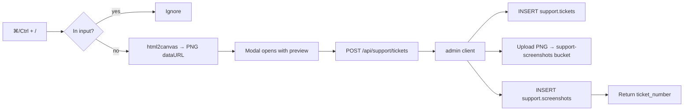

# Support Hotkey — `⌘ / Ctrl + /`

> User presses **⌘+/** (macOS) or **Ctrl+/** (Win/Linux) anywhere in the app.
> A modal opens with a viewport screenshot, the URL, browser/OS context, and
> the last 50 console messages pre-attached. They type a subject + optional
> details + priority and submit. A row lands in `support.tickets` with the
> screenshot stored privately in Supabase Storage.

---

## Files

| File | Purpose |
|------|---------|
| `web/src/components/support/SupportHotkey.tsx` | Client component: keyboard listener + capture + modal + submit |
| `web/src/app/api/support/tickets/route.ts` | Server route: validates auth, inserts ticket, uploads screenshot |
| `web/src/app/layout.tsx` | Mounts `<SupportHotkey />` once, app-wide |
| `supabase/migrations/005_support_schema.sql` | `support.tickets`, `support.screenshots`, etc. |

---

## One-time Supabase setup

Create a **private** storage bucket `support-screenshots`:

```sql
-- In Supabase SQL editor (or via supabase CLI):
INSERT INTO storage.buckets (id, name, public) VALUES
  ('support-screenshots', 'support-screenshots', false)
ON CONFLICT (id) DO NOTHING;

-- RLS policy: users can read screenshots for tickets in their own org.
CREATE POLICY "support-screenshots-read-own-org"
  ON storage.objects FOR SELECT
  USING (
    bucket_id = 'support-screenshots'
    AND (storage.foldername(name))[1] = (
      SELECT org_id::text FROM public.profiles WHERE id = auth.uid()
    )
  );

-- Writes only via service role (the API route).
CREATE POLICY "support-screenshots-no-client-writes"
  ON storage.objects FOR INSERT
  WITH CHECK (bucket_id <> 'support-screenshots');
```

Path layout: `support-screenshots/{org_id}/{yyyy}/{mm}/{ticket_id}.png`

---

## How it works



### Captured automatically

- `source_url`, `source_route`, `source_user_agent`, `source_viewport`
  (`{w,h,dpr,os}`), `referrer`, `timestamp`
- Last 50 console messages (`metadata.consoleTail`)
- Screenshot of the **visible viewport** (privacy: we don't shoot off-screen content)

### Trade-offs / notes

- `html2canvas` rasterizes the DOM in-browser; it doesn't capture iframes from
  other origins or `<canvas>` content from cross-origin sources. Acceptable
  trade-off for an internal-tool ticket helper.
- Screenshot upload is best-effort: if it fails, the ticket still gets created.
- Hotkey is suppressed when typing `/` inside `<input>`, `<textarea>`, or any
  contenteditable region.
- Modal is `Esc`-dismissible and focus-traps the subject input on open.

---

## Future enhancements

1. **DOM serialization** (rrweb / "snapshot") for replay-style debugging.
2. **HAR / network log** capture (last N requests with status + duration).
3. **Browser extension fallback** for capturing the entire scrollable page.
4. **Auto-attach Sentry event id** if a recent error was thrown.
5. **Quick-action follow-up**: "Restart my agent", "Reboot my device", "Re-sync M365"
   buttons inline in the modal that fire MSP Agent + Graph commands.
6. **Triage rules** (`support.triage_rules`) auto-route + set priority.
7. **AI summary** via server action calling `gpt-4o-mini` over body+screenshot
   filling `tickets.ai_summary` and `tickets.ai_kb_article_ids`.
